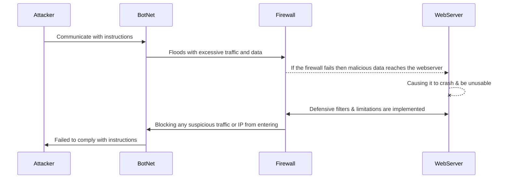

# kjbanegaslab2.github.io

## DDoS Attack and Defense Diagram

#Lab 2 

##DDos Attack & Defense

```mermaid
sequenceDiagram
    participant Attacker
    participant BotNet
    participant Firewall
    participant WebServer
  Attacker->>BotNet: Communicate with instructions 
  BotNet->>Firewall: Floods with excessive traffic and data
  Firewall-->>WebServer: If the firewall fails then malicious data reaches the webserver 
  WebServer--xWebServer: Causing it to crash & be unusable
  Firewall<<->>WebServer: Defensive filters & limitations are implemented 
  Firewall->>BotNet: Blocking any suspicious traffic or IP from entering 
  BotNet->>Attacker: Failed to comply with instructions 

```
