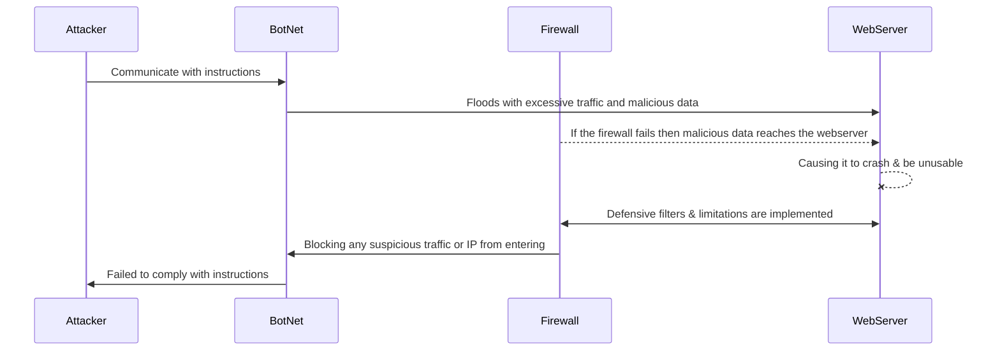

# kjbanegaslab2.github.io

## DDoS Attack and Defense Diagram

# Lab 2 

## DDos Attack & Defense Diagram

## Decription

### Attack:

* The Attacker will use BotNet to carry out their attack. They instruct the BotNet to send malicious info to WebServer.
* The BotNet will then try to bypass the Firewall to flood the Webserver with excessive traffic and malicious data 
* Once the excessive traffic and malicious data reach the WebServer, it will cause it to crash and be unusable.
* These attacks can lead to the following 
 * Loss of revenue
 * Loss of private information 
 * Damage to reputation
 * Etc.

### Defense:

* The Firewall will prevent the BotNet from sending excessive traffic and malicious info to the WebServer.
* The Firewall uses techniques like the following
 * Traffic Filtering 
 * Rate Limiting 
 * IP Blocking 
 * Password Changing 
 * Etc. 
* This will prevent the BotNet from following the Attacker's orders and prevent a DDoS Attack.

